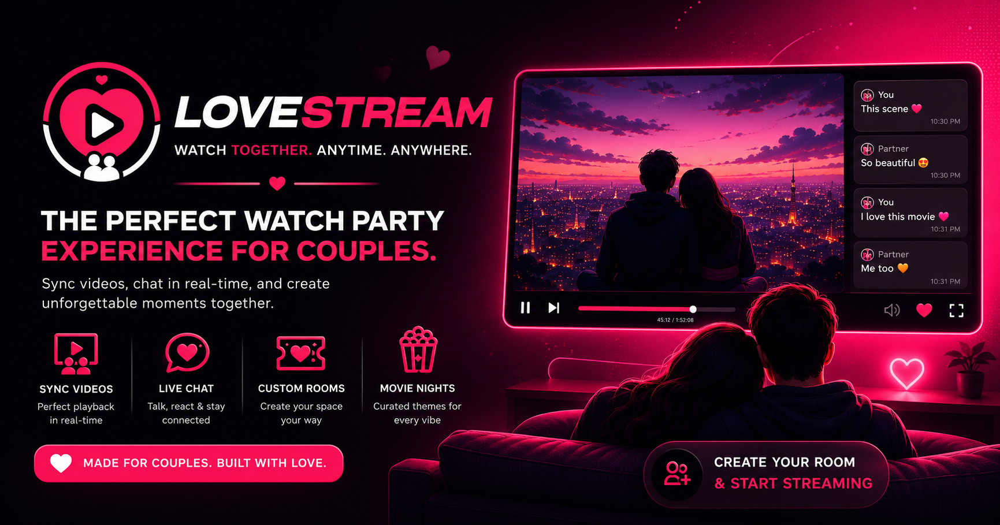

# LoveStream




---

## What is LoveStream?

I built LoveStream because I wanted a simple, private way to watch YouTube videos in sync with someone else — no accounts, no bloat, no third-party screen sharing tools. Just paste a link, share a 4-character room code, and watch together in perfect sync from anywhere.

Beyond video sync, I added real-time chat with emoji reactions, typing indicators, and a full P2P video calling system using WebRTC — all running over a single WebSocket connection I manage on the backend. Everything stays between you and the other person, no data goes anywhere else.

---

## What I Built Into It

- **Synchronized Playback** — When one person plays, pauses, or scrubs the video, I make sure both sides update instantly with latency compensation so nothing feels out of sync.

- **Private 2-Person Rooms** — I deliberately capped rooms at 2 participants and used short 4-character codes to keep things simple and intimate. No sign-ups, no accounts.

- **Real-Time Chat** — I built a live chat panel with typing indicators so you can see when the other person is writing. On desktop you can hover over a message to react with an emoji, on mobile I implemented long-press detection for the same thing.

- **Flying Emoji Reactions** — Quick reaction bar at the bottom of the chat lets you send emojis that fly up across the screen — something small I added to make the experience feel alive.

- **P2P Video Calls** — I integrated WebRTC directly so both people can video call each other without any third-party server handling their video feed. The WebSocket connection I already had doubles as the signaling channel, so no extra infrastructure needed.

- **Auto-Reconnect** — Sockets drop sometimes. I wrote reconnection logic on both the client and server side so if someone briefly loses connection, the session recovers without them having to rejoin manually.

- **Autoplay Handling** — Browsers block autoplay with sound by default. I handle this gracefully — the video starts muted if needed and I show a clear unmute prompt so the experience doesn't feel broken.

- **Mobile-First Responsive UI** — I designed the layout to work properly on phones and tablets, not just desktops. Touch events, safe area insets, responsive grids — all handled.

---

## Tech Stack

| Layer | What I Used |
|---|---|
| Frontend | React 19, TypeScript, Vite, Tailwind CSS v4 |
| Backend | Node.js, Express, `ws` (WebSockets) |
| Video | YouTube IFrame Player API |
| Video Calls | WebRTC — `RTCPeerConnection` + Google STUN |
| Deployment | Render (`render.yaml`) |

---

## Running It Locally

### Prerequisites
- Node.js v18+
- npm

### Install

```bash
git clone https://github.com/ankitkhatrik6/LoveStream.git
cd LoveStream
npm install
```

### Development

```bash
npm run dev
```

This starts both the signaling server and the Vite frontend together. Open `http://localhost:3000` in your browser.

### Production Build

```bash
npm run build
npm start
```

---

## How to Use It

1. Go to [love-stream.onrender.com](https://love-stream.onrender.com) or run it locally.
2. Enter your nickname and click **Create Room** — you'll get a 4-character room code.
3. Share that code (or the invite link) with whoever you're watching with.
4. They enter the code, hit **Join Room**, and you're both connected.
5. Paste any YouTube URL into the **Queued Up** bar and hit **Change Video**.
6. Play, pause, and seek — it stays in sync on both ends automatically.
7. Use the chat panel on the right to message in real-time.
8. Click **Start Video Call** anytime to start a P2P video call on top of everything.

---

## Deployment

I deployed LoveStream on **Render** — the `render.yaml` in the repo has the full configuration. The same Node.js server handles both the WebSocket signaling and serves the built frontend, so it's a single service deployment.

Live at: [love-stream.onrender.com](https://love-stream.onrender.com)

---

## License

MIT — do whatever you want with it.

---

> If you find this useful or interesting, a ⭐ on the repo goes a long way. — **Ankit Khatri KC**
